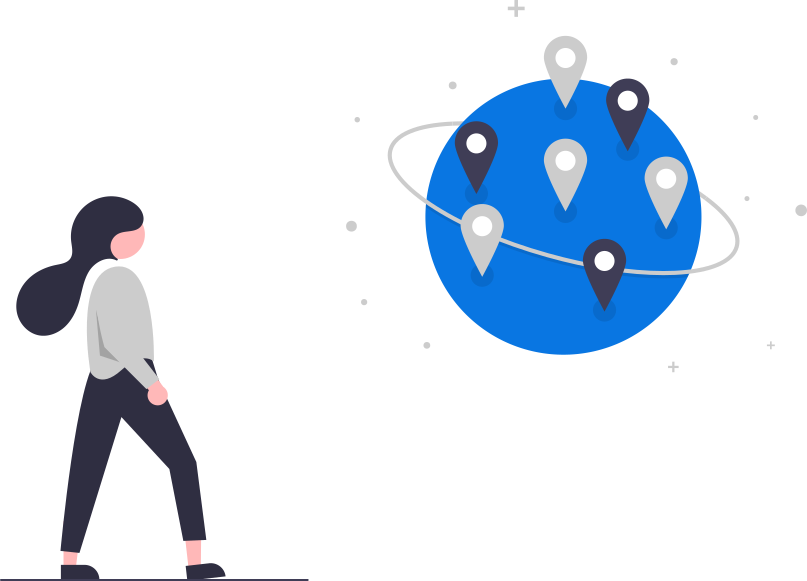
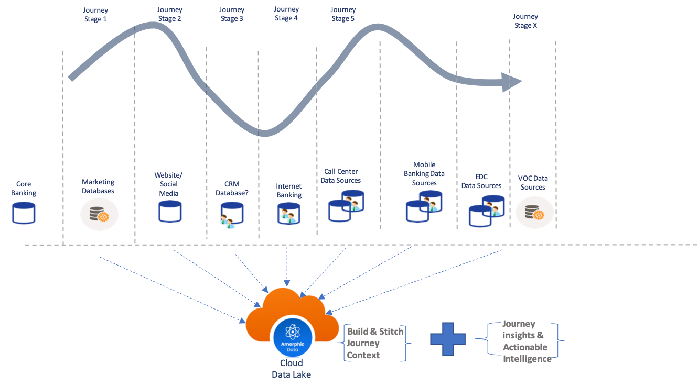

In recent years, companies have realized that Customer Experience (CX) enabled by customer journeys has become a key differentiator for survival and growth. Earlier post titled “From Customer Service to Customer Experience journeys - Data driven capabilities hold the key” highlighted the importance of building data driven capabilities for transforming the CX journeys (a.k.a Customer Journeys). In this post we look into high level architectural requirements of building a customer 360 (C360) Journey analytics platform.

<!-- truncate -->

### What is Customer Journey?

Customer Journey is a sequence of touchpoint interactions between a business and its customers to complete a certain task across one or multiple channels.  Customer Journey is typically divided into multiple stages/phases as shown in Figure 1. Each stage is controlled by a different business function or stakeholder. Interaction data from each stage gets stored in a separate data repository across the enterprise. This results in a single customer’s journey data split across multiple organizational silos. This is one of the biggest challenges in a traditional product centric enterprise which stalls them in their effort of building a C360 Journey Analytics platform. Let’s look at some of these challenges in next sections.

### What is Customer 360 Journey Analytics?

C360 Journey analytics is an advanced analytical approach which aggregates end-to-end customer journey data from multiple data sources into a single platform for data processing, journey analysis/insights and consumption. Journey insights are further used to design future state customer journeys which in turn results in superior customer experience.

### Why Journey Analytics?

Firstly, journeys reflect real customer needs and goals as seen through the eyes of the customer. It takes into account “what job is the customer trying to get done”, “what is the customer thinking and feeling”, “what questions are there in the mind of the customer” and “what pain points does he/she have”. Secondly, studies have shown journeys are more tightly connected with business outcomes as opposed to touchpoint interactions. As per McKinsey, journey analytics can boost sales by 35% and customer satisfaction by 25pt

(ref [https://www.mckinsey.com/solutions/journey-analytics](https://www.mckinsey.com/solutions/journey-analytics)).

### What can Journey Analytics do?

Some of the use-cases enabled by journey analytics are cross/up-sell, path analysis, faster problem resolution, churn reduction, call traffic migration and improved customer acquisition. Performance metrics like cost2serve, CSAT and NPS have responded well to customer journey improvements. Further, journey analytics can help find out:

- friction/leakage points (inconvenience causing interaction points forcing the user to abandon,
- moments of truth (when customer needs you the most),
- high customer effort areas (lot of manual activity),
- purchase decision points and
- influence/recovery (point of recovery prior to customer churn) points etc.

#### What is required to build a Customer 360 journey analytics platform?

Figure 1 illustrates a high-level concept of a journey analytics platform. A hypothetical customer journey map can be plotted with multiple journey stages shown. Each stage is generating heterogenous data that needs to be ingested into a unified data store (read more in the later sections). Data pipelines can be built to stitch the interaction context from every stage across the entire journey. This journey context (see below) will help maintain a common understanding of the customer context across different stakeholders in the company:

__Journey Context:__
    - Who is the customer?
    - What drove the interaction?
    - What is the job-to-be-done in that stage?
    - What did he do (content of the interaction)?
    - What was the outcome of that stage?

Basic technology requirements

Let’s look at some high-level technical requirements for implementing a journey analytics platform. 

**Variety:** handle structured, semi-structured and unstructured customer data coming from variety of sources like CRM, Marketing Databases, Call center, Social media, IOT, VOC etc.

**Velocity:** while on one side there could be batch uploads of customer events, on the other side of spectrum there could be real time heterogenous data streams from IOT sensors. For e.g. a vehicle rental company wants to monitor driver behavior using data streaming from IOT sensors placed in the rental car. Platform should handle both synchronous and asynchronous ingestion of data sources for the above to be possible. 

**Scale:** As customers interact more and more in the digital world to purchase, consume and provide feedback about products/services, data gets generated in large volumes that needs to get stored and processed. For e.g. social media feeds, audio/video conversations, image feeds require a whole new storage and data processing scale for a journey analytics platform.

**Unified Data store and integration:** to solve the data silos challenge, all data from different interactions across the customer journey stored in different places need to be stored in a single place to be able to stitch the journey context. Further these datasets from different platforms need to be integrated and transformed for consumption. 

**Multiple identities:** customers will carry multiple identities across different channels i.e. email address, account numbers, website user ids, phone numbers, customer IDs, cookie IDs etc. Some of these identities are temporary and some permanent. Like a customer browsing the website as anonymous user needs to be tracked with cookie ID as opposed to website user ID once the user signs on to the website. All identities need to me mapped to a universal identity across channels.

**Sharing, search and self-service:** once customer 360 data from different channels/transactional data sources is aggregated and stitched, it has to be shared with multiple departments and end-users for different consumption needs. For e.g. on one side, a call center agent would like to pull the customer journey timeline for the past 3 months from the C360 platform for better context to resolve the customer query. On the other hand, a product manager would like to query the system to address “Which customers provided a negative feedback in the past 3 months about a certain product which was launched few months ago”.   

**Advanced Analytics and ML:** once the C360 data is aggregated, processed and cleansed, various departmental functions would like to perform further advanced analysis to get relevant business insights. For e.g. a Line of Business (LOB) executive would like to build a churn model to predict and prevent churn. For that, he would like to understand the “most frequented” path to churn so that he can mine the customer conversations along that path for “top reasons for churn”. All C360 data and metadata should be accessible to other tools to perform AI/ML analysis to get answers to critical business questions.    

In a separate post we look into implementation aspects of building a journey analytics platform using an AWS cloud data lake and an orchestration service like Amorphic.