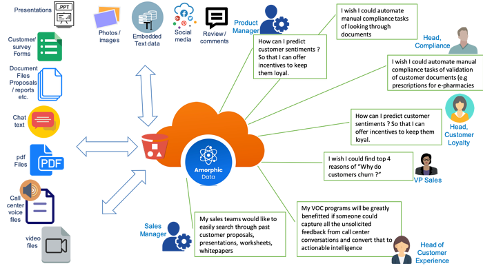
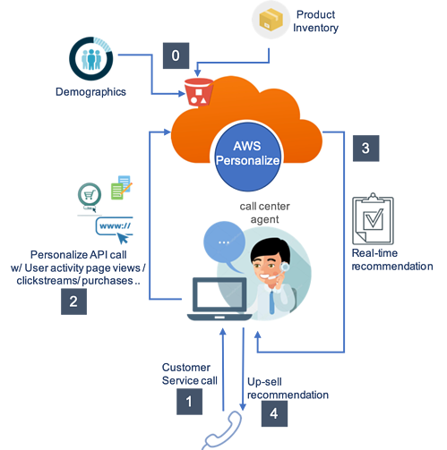

AI/ML is required to add data-driven intelligence to your business workflows and is proving to be a pre-requisite for your digitization journey. Many companies are unable to put together ML expertise very much required to train and deploy analytical models. AWS pre-trained AI services can fast-forward your digitization journey by enabling your existing applications with these capabilities with zero ML expertise.

<!-- truncate -->

### What is Digitization?
Digitization has been defined in more than one way. In a very literal sense, it means converting information from analog to a digital format for further processing using digital technologies. In a broader sense digitization has been used to define modernization of processes, customer/employee engagement, business models by using digital technologies like IOT, AI/ML, Blockchain, AR/VR, 3D printing etc.

More and more aspects of our lives and work are getting digitized with the use of smart endpoints like PCs, mobile phones, wearables, sensors etc. A few examples below illustrate the concept and scope for digitization:

1. IOT is bridging the gap between the physical and digital world by digitizing the attributes of physical things into digital formats. For e.g. a car being driven on road has many physical attributes related to speed, fuel, battery level, tyre pressure etc. which need to be in order for a smooth drive. IOT sensors in a car digitize these attributes into a digital format which can be monitored and further analyzed for things like predictive-maintenance and driver behaviour. 
2. The process of filling up a paper forms to register for a hospital admission can be fully digitized and automated by doing it through a mobile app or partially by scanning and digitizing the filled forms for further processing. 
3. Social conversations are getting digitized through social media platforms where human choices, preferences and behaviors are being monitored and exploited in the digital world.  
4. In traditional companies, employee meetings and inter-departmental communication happened using paper-based meeting minutes and inter-department circulars. In a modern set up, meetings happen over an audio conference bridge where meeting content is recorded in natural language formats. Inter-employee communication primarily happens over email again stored in natural language digital format. 
5. In healthcare ecosystem hospital records, doctor prescriptions, medication bills, test reports, hospital discharge summaries are stored and in a mix of physical (paper) and digital formats.
6. Court proceedings traditionally used to get manually recorded on paper where the main artifacts were courtroom arguments, witness statements, police/forensic reports etc. A lot of these artifacts now get stored in the form of digital images, audio conversations and text documents3 6

All of the above are examples of varying levels of digitization ranging from completely manual to converting a portion to digital format or transforming and entire process or workflow using digital technologies. There can be numerous other scenarios where digitization opportunities can be explored.

### Where are the digitization opportunities?

There is a lot of unstructured information being generated in any organization from customer/employee/partner interactions, production and consumption activities. Some of this info is 

1. being recorded/stored and being actioned upon partially due to perceived scope
2. being recorded/stored but NOT being actioned upon due to lack of vision, know-how or resources 
3. NOT being recorded and stored for the same reason as (b)
4. being recorded but stored in non-digital formats

With advancements in neural networks/deep learning, techniques like computer vision, speech recognition, natural language processing make it possible to extract insights from unstructured information in the form of text, audio, image and videos. However, one major roadblock was the expertise required to train, deploy and maintain ML models. With the introduction of AWS pre-trained ML services, a lot of that complexity is taken away from developers and brought in the fold of AWS.  Customers can now leverage these services to add machine intelligence to their applications without keeping any ML expertise.

### What are pre-trained AWS AI services?

AWS pre-trained ML Services provide ready-made intelligence for your applications and workflows accessed using API calls. These API based services easily integrate with your applications to address common use cases such as personalization, modernizing your contact center, improving safety and security, and increasing customer engagement. ML Services on AWS don't require machine learning experience. Some of these services cover:

- Recommendations
- Forecasting
- Image & Video analysis
- Advanced Text comprehension analysis
- Document analysis
- Speech-to-text transcription 

**Digitization examples with AWS AI services:** We study two of the above services and look at how they can be applied to real life problems.

### Advanced text analytics with Amazon comprehend:
Amazon comprehend allows extraction of entities, languages, key phrases, sentiment analysis, topic modeling from natural language interactions. Figure 1 below depicts an opportunity landscape of extracting insights from natural language unstructured information.

*Figure 1*

Figure 1 shows different types of natural language interactions in the form of audio, video/image, chat, social media streams, surveys, documents, presentations etc. All these files can be ingested into Amorphic Cloud Data lake which in turn leverages AWS ML services. On the right side shows multiple possibilities of extracting business value by building data pipelines around AWS translate, recognize, transcribe and mainly comprehend services.

**Recommendations with Amazon Personalize:** personalized recommendations have been a hallmark of Amazon e-commerce site which suggests relevant products based on user behaviour. Such recommendations require deep ML expertise for training and deployment of ML models. Amazon personalize API allows companies to build personalization capabilities with ML dependencies shifting to the AWS ML service. Figure 2 lists a use case where call center agent can leverage this service to create up-sell opportunities. Let’s walk through the call flow highlighted in Figure 2.

*Figure 2*

1. Customer places a customer service call and starts a conversation with the agent who senses an up-sell opportunity as customer is in a good mood as his problem got solved. 
2. Agent seeks an “up-sell recommendation” through a button on his CTI screen. Under the covers an AWS Personalize API call is invoked which passes customer’s past clickstream/call center activity, past purchases to AWS Personalize. 
3. AWS personalize executes a pre-trained recommendation model that returns a personal recommendation on his CTI screen in real-time while customer is on the call with the agent.
4. Agent communicates the recommendation to the customer to convert an up-sell opportunity234

As seen in the examples above, there is application development expertise required to realize the above solution but with zero ML expertise. Likewise, other AWS ML services also provide the same benefits without the customer investing in ML resources. 