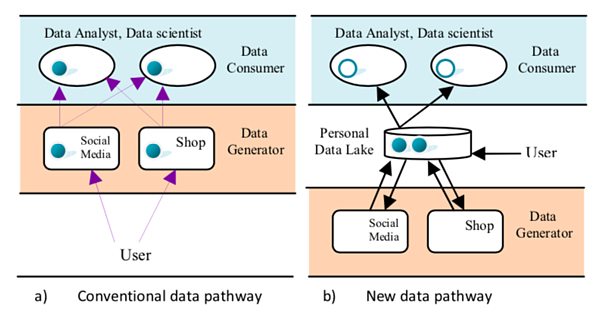

For an individual, their daily interactions with digital services and devices generate a certain amount of data every day, which increases exponentially over time, resulting in large and complex datasets of different formats. This presents challenges in not only storing all the different variety of data in a single platform for easy access but also in the processing of these data sources. In order to optimize cost of data processing workflows it is important to decouple the storage and compute of the data so that they can be scaled independently. A cloud data lake is increasingly becoming a popular choice for solving these challenges.

<!-- truncate -->
Amorphic Data is the first cloud orchestration SaaS or Managed Service platform that solves the challenges of building a data lake and makes it easier for data consumers to easily access and manage their data on cloud. It supports the ingestion and transformation of all structured, unstructured and semi-structured data specific to your use cases. On top of its data lake capabilities, it also provides compute capabilities with cloud data, advanced analytics and machine learning services in a single pane of glass for all types of users. 

Following points will go through the details of how Amorphic data handles the variety and volume of data effectively with decoupled storage and compute:

### Variety:

A data lake solution should be able to deal with the ingestion of the different formats of data. There are many existing incompatible data formats; data structures and data semantics coming from variety of sources like CRM, Marketing Databases, Call center, Social media, IOT, VOC etc., and many more will appear in the future. 

Addressing the challenges of variety of data - Amorphic Data provides the capability to ingest the different format of data – excel, csv, text, pdf, jpg, mp3 etc. into the platform. It is primarily an Amazon S3 based data lake solution that uses Amazon S3 and Redshift as its storage platform. Amorphic Data can help in storing all data types in their native format. 

### Volume:

Each data chunk has its own importance w.r.t the data size and its applications and when these two characteristics become large it becomes difficult to manage in terms of time, logistics and cost effectiveness to move the data from one space to another over the network. Although the volume of an individual customer is relatively small, owing to the richness of information present in them and personal data governance and protection – all these add weight to the data stores. This concept is called “data gravity”.  For example, a users social media feeds, audio/video conversations, image feeds and their analysis requires a whole new storage and data processing scale. These types of customer data and its usage make up a vast percentage of Big Data that contributes to the 2.5 quintillion bytes of data being created by consumers and enterprises everyday. 

AWS S3 provides an optimal foundation for a data lake because of its virtually unlimited scalability. Amorphic data is designed for cost-effective scalable performance as AWS S3 and AWS Redshift power it, which help in managing both the variety and volume of data.  This leads to high scale data handling as you can seamlessly increase storage from gigabytes to petabytes of content in Amorphic Data. The data processing of the data on such a scale also require high concurrent execution. Amorphic data infrastructure allows multiple queries to execute in parallel on the same or different slices of data.  

But due to the sheer volume of big data and its usage, applications are pulled towards them rather than vice versa. In order to facilitate this interaction and handle the challenges of data volume and variety effectively, it is important to achieve the decoupling of data and its applications. 

### Decoupled Storage and Compute:

In traditional Hadoop and data warehouse solution, storage and compute are tightly coupled, making it difficult to optimize costs and data processing workflows. But with Amazon S3 as the data lake storage platform in Amorphic Data, once you have different types of data cost-effectively stored in their native format, you can use AWS analytics tools to process your data. However, owing to the importance of data, its applications and the importance of security protection and governance, a futuristic view of a data lake should be such that each individual user has ownership of their personal data lake. The above figure depicts the typical data journey within a conventional data pathway (a) as opposed to new data pathway depicted in (b). In (b) a personal data lake not only serves as a silo for consolidating personal data, but also provides data management, security protection of user's data and query interface to transform the raw data into a structured data for downstream analysis.  This way storage and compute can be decoupled and data consumers like Data Analyst and Data Scientists can generate the transformed data from the raw data using the query interfaces. Overall the contemporary solution for Data Lake is somewhere between the conventional data lake and data gravity concept for storing a wide variety of data.

*Figure 1*

Amorphic data is a data lake solution that concords with the above concept of decoupling of storage and compute. Because of its reliance on AWS S3 as the storage solution as opposed to Hadoop and data warehouse based solution, it provides for decoupling of storage and analytics. It provides a query interface to query the raw datasets using either native AWS AI and ML services or SQL-like query on the data in AWS S3 and transform it into another dataset for downstream analysis. Moreover, it has user access and management that provides a way to give secure access to different data consumers. This helps in providing a guarded entry point for integration with third party applications or other AWS services in no time supporting interoperability with few clicks.