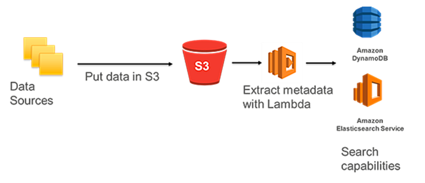
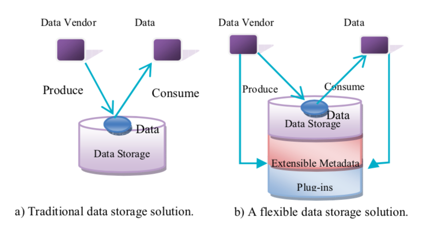

Most modern data lakes hold an ocean of possibility for organizations eager to put analytics to work.
But owing to its ability to store anything and everything, a data lake runs the risk of turning into a “data swamp”. 
A data lake can easily be polluted with data from everywhere, incapable of getting meaningful data out to anywhere.
It is important that a data lake does not become a swamp because then it will not only lead to security issues but also
reduce its usage over time.

<!-- truncate -->

One of the most common challenges that data consumers face when using a data lake is their inability to find, understand and trust the data they need from a data lake in order to extract business value from it. A data scientist or a data analyst is forced to deep dive into the depths of a data lake in order to find the data that they need to present the results of analysis to business stakeholders. They have to search across undefined datasets from multiple sources, which can be a time consuming process. Good data governance becomes a necessity in a data lake as it enables an organization to ensure high quality data exists throughout the complete lifecycle of the data. A governed data lake contains relevant data from structured, unstructured sources that can be easily found, accessed, shared, managed and protected. One of the ways that this can be achieved is via data cataloging.

### Data Catalog:

A data cataloging thus becomes an important part of a data lake that helps in keeping track of all the raw assets, as they were loaded into a data lake and also tracking all the new data assets and versions that were created by data transformation, data processing and analytics. The data catalog is designed to provide a single source of truth about the contents of a data lake. 

Amorphic Data has two forms of data catalog – a comprehensive data catalog can be used to search for all datasets in the data lake and their related metadata, and a Hive Metastore Catalog can be used to discover and query data sets in a lake. 

Comprehensive data catalog contains information about all the data that has been ingested into the S3 data lake. Amorphic data uses various compute services like AWS Lambda, Amazon DynamoDB and search engine services like Amazon Elastic-search in order to accomplish comprehensive data cataloging.

*Figure 1*

Amorphic Data also uses AWS Glue to create a Hive-compatible Metastore Catalog. All the datasets that gets registered in Amorphic Data console, also gets registered in AWS Glue to build the data catalog. AWS Glue crawls the S3 buckets for data sources and constructs a data catalog using pre-built classifiers for many popular source formats and data types like CSV. Currently the platform stores the catalogs for CSV data but it can be easily extended to incorporate other data formats like JSON, Parquet and more. Amazon Athena, Amazon Redshift and Amazon Glue ETL use this AWS Glue generated catalog for the purpose of advanced analytics in Amorphic Data.  This is also one of the other factors, which ensures decoupling of storage and compute in Amorphic Data. 

Apart from the above two approaches, Amorphic data also allows the data producer to tag the datasets for the purpose of search.

A data lake can have the data in both its raw format and transformed clean format.  But sound governance policies must also ensure that the user is able to access and share the relevant data in a protected fashion.

### Security & Sharing:

Another important part of effective data governance is data protection and sharing. Since the Amorphic platform is based on top of AWS architecture, it ensures the standard AWS security benefits which leads to increased end user data privacy at a lower cost. All the datasets are stored in highly secure AWS data centers. Data at rest and data in motion are encrypted in Amorphic Data. In terms of sharing, it is important to implement role-based security in a data lake. Role-based security is an approach to restricting system access to authorized users. But a data lake should be able to support all users and thus should have a user access management system with users, groups and domain-level access to share data with different team members across different locations in a secure fashion. On top of encryptions and access controls, a data lake should have a procedure to pro-actively scan all the customer datasets in it for any protected infromation. Amorphic data uses AWS Macie for the security scans on its datasets. Effective security in the end also involves effective logging and reporting capabilities. A data lake can use a wide variety of AWS services internally and each of these services should be logged and monitored. Amorphic Data uses AWS Cloudwatch for logging and monitoring and AWS Cloudtrail to gather and store audit logs of API access related information. All this provides for security and governance required to access the user’s data.

### Metadata management:

Matadata management is a central part of achiveing effective data governance in data lake architecture. Thus, an efficient metadata management system is regarded as an essential component of successful data lake as it also prevents a data lake from truning into a “data swamp”.  It is important that a data lake does not become a swamp because then it will not only lead to security issues but also reduce its usage over time. This requires metadata to be stored with raw data and kept inside the lake until queries arise. So a metadata repository that registers high-level information about data entities is an essential component of a robust data lake strcuture as it alleviates the problem of incomprehensibility of the data. But due to sheer volume and variety of the data it cannot totally prevent it. 

*Figure 1*

Amorphic Data addresses this challenge by providing different metadata management system for different types of data:

1. For structured/semi-structured data:  Amorphic Data contains information about the schema of the data so that the data can be transformed into a queryable data object when required.
2. For unstructured data, it allows the integration of different AWS AI services and provides a guarded interface to the user, so that unstructured data can be analyzed and queried and converted into a structured data object.
 
Amorphic Data has a flat architecture that addresses these challenges systematically and provides a self-service user interface that starts with basic schema for structured data and no schema for unstructured data.  You can query the datasets and transform them into a defined schema structures and track the various stages of datasets that gets generated in the process.