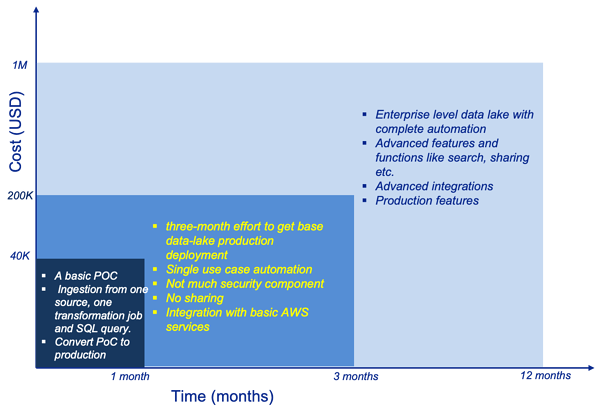

From our experience of building data lakes for customers on AWS, it could cost anywhere between 200K - 1M USD depending
on the complexity and number of features they want. For you to understand the above numbers please refer to my earlier post
"Journey of Building a Data Lake on AWS - from Ideation to Business Value" where I outlined the journey of setting up an
enterprise data lake.

<!-- truncate -->

As mentioned in my earlier post there are two distinct types of customers interested in building data lakes.
Those who need to build a sophisticated data lake platform and those who need to build a use-case driven
data lake with limited features.

Figure 1 simplifies the step diagram from the previous post. In summary,
one-month POC effort would cost 40K whereas a three-month effort to get a single use case base data lake into production
with CI/CD automation for infrastructure and minimum security features would cost around 200K USD.

For a high-end enterprise data lake platform, this can go as high as 1M USD.
It is worth mentioning that a majority of the cost for the data lake implementation phase will be for skilled manpower.
AWS infrastructure cost will be minimal to build the data lake because of the server-less architecture.
The cost of building an enterprise data lake on AWS is still significantly less than building an on-premises Hadoop data lake.

Ongoing management and support of an enterprise data lake platform will require at least 40% of the resources used during the build phase.
If you had 10+ resources in the initial build phase, then you need at least 4 resources for ongoing management and support.

We have provided the above cost estimates based on our experience helping multiple customers
ranging from small companies to big enterprises with their AWS data lake strategy and implementation.
The actual cost may vary for a new data lake build depending on the features, complexity, security and governance requirements
of the customer.